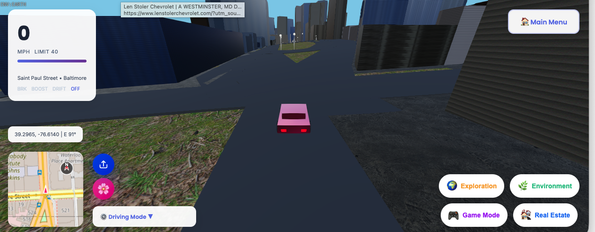
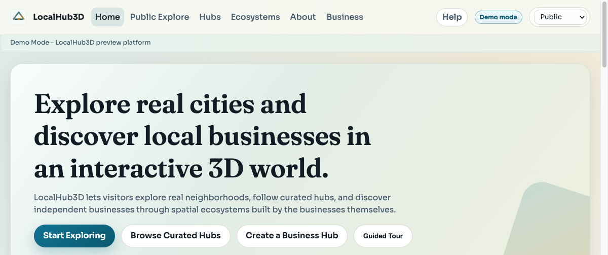
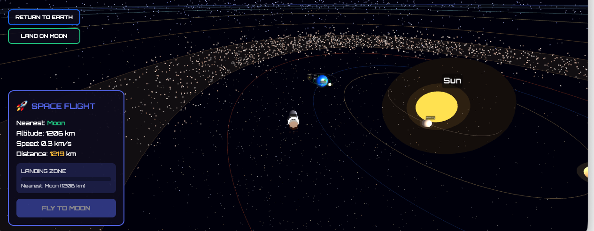
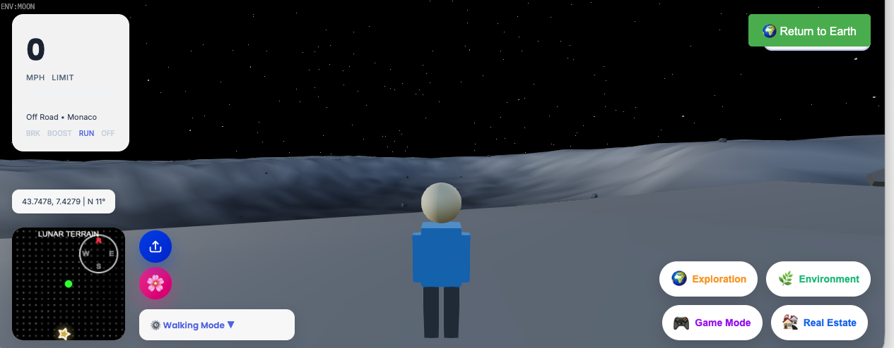
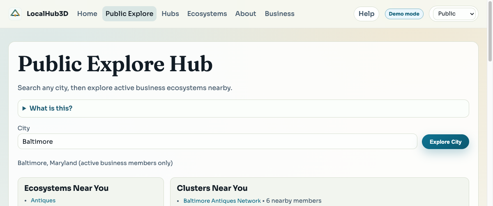
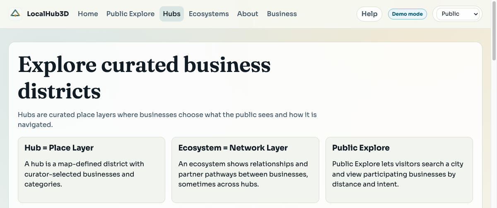

# Steven Reid

Self-taught developer and independent researcher building browser software and recursive algorithm tooling.  
I am early in my career, but I treat shipping quality, reproducibility, and honest validation as core requirements.

  
  

## Flagship Projects

### 1) WorldExplorer3D

Browser-native geospatial exploration engine with shared multiplayer presence.

What makes it interesting:
- Explore real-world cities directly in the browser.
- Use walk, drive, and fly modes in one runtime.
- Transition from Earth to space to Moon in the same session.
- Join multiplayer rooms with shared presence and social interactions.

Tech stack: JavaScript, WebGL/Three.js runtime, Firebase services, browser-first deployment.

Links:
- Live demo: [worldexplorer3d.io](https://worldexplorer3d.io)
- GitHub: [RRG314/WorldExplorer3D](https://github.com/RRG314/WorldExplorer3D)

  
  
  

### 2) LocalHub

Business-facing hub creation platform with public local discovery.

What makes it interesting:
- Businesses can create hubs and publish structured local ecosystems.
- Discovery and reviews are ecosystem-aware, using structured feedback concepts.
- Designed for global access while preserving local relevance.
- Includes demo-first operation with a path to live backend integrations.

Tech stack: HTML/CSS/JavaScript, browser 3D map runtime, optional Firebase and Stripe integrations.

Links:
- GitHub: [RRG314/localhub3d](https://github.com/RRG314/localhub3d)

  
  
  

### 3) RDT Toolbox

Recursive Division Tree toolkit for deterministic hierarchy and indexing experiments.

What makes it interesting:
- Implements deterministic hierarchy primitives around recursive tree structure.
- Includes tree geometry utilities: depth, path-to-root, LCA, and ultrametric distance.
- Built with reproducibility in mind, including tests, CLI workflows, and benchmark reports.
- Research and experimental only. No cryptographic security claims.

Tech stack: Python, CLI + library API, reproducible benchmark/test tooling.

Links:
- GitHub: [RRG314/RDT-toolbox](https://github.com/RRG314/RDT-toolbox)

## Other Work

- [topological-adam](https://github.com/RRG314/topological-adam): Experimental PyTorch optimizer extending Adam with energy-stabilization terms for training dynamics research.
- [rge256](https://github.com/RRG314/rge256): ARX-based PRNG family focused on deterministic, non-cryptographic randomness for simulation and compute workloads.
- [rdt256](https://github.com/RRG314/rdt256): C-based recursive-entropy PRNG suite with explicit build scripts, benchmark flows, and reproducibility artifacts.
- [rdt-kernel](https://github.com/RRG314/rdt-kernel): PyTorch nonlinear PDE kernel for recursive diffusion experiments on CPU and GPU.
- [rdt-spatial-index](https://github.com/RRG314/rdt-spatial-index): Recursive logarithmic spatial indexing work with benchmarked exact-query behavior.
- [rdt-noise](https://github.com/RRG314/rdt-noise): Structured noise synthesis experiments connected to recursive depth mechanics.
- [RDT-entropy](https://github.com/RRG314/RDT-entropy): Integer shell entropy analysis framework built from RDT depth distributions.
- [Recursive-Adic-Number-Field](https://github.com/RRG314/Recursive-Adic-Number-Field): Ongoing preprint and implementation trail for recursion-based number system constructions.

## What I’m Focused On Now

- Making every core repo installable and testable in clean environments.
- Tightening benchmark honesty so claims match reproducible evidence.
- Turning RDT tooling into practical developer utilities with clear docs.

## Validation Snapshot (2026-03-04)

- `topological-adam`: clean install and test run passed (`73 passed, 2 skipped`) after hardening updates.
- `rge256`: now pip-installable with native fallback; clean test run passed (`7 passed`).
- `rdt256`: build, validation, and benchmark flows ran successfully from source.
- `rdt-kernel`: install and tests passed, and CPU benchmark timing was captured.

Detailed notes: [Validation and Testing](validation.md)

## Background and Research Links

I study how simple deterministic recursion can produce hierarchy, valuation, and measurable structure.  
Much of this line of work centers on the Recursive Division Tree and its computational consequences.

- ORCID: https://orcid.org/0009-0003-9132-3410
- Zenodo publications: https://zenodo.org/search?q=Steven%20Reid
- GitHub: https://github.com/RRG314

## Site Sections

- [Papers](papers.md)
- [Code](code.md)
- [Validation and Testing](validation.md)
- [CV](cv.md)
- [Mentorship and Contact](mentorship.md)

## Contact

- GitHub: https://github.com/RRG314
- Email: `your-email@domain.com` (placeholder)

If you want to collaborate, test a repo, or review claims, I welcome direct feedback and issues.
